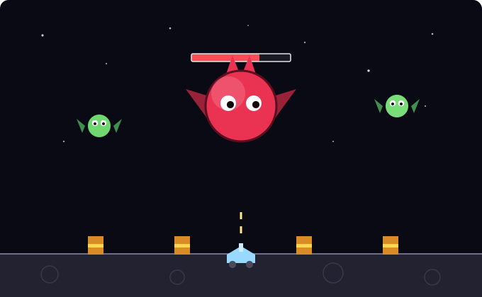

# Moon Bugs — Lunar Defense

A modern, [macroquad](https://macroquad.rs/)-based homage to Windmill Software's
1983 arcade game *Moon Bugs*.

Defend a row of fuel drums on the lunar surface from swooping alien bugs. Bugs
descend in weaving patterns, then dive to grab a drum and haul it off the top of
the screen. Shoot a carrier and it **drops the drum** — which falls safely back
to the ground if it survives the trip. Lose all your drums (or all your lives)
and it's game over.



*Every 10th wave a high-HP boss appears (and the music turns ominous).*

## Download

Prebuilt binaries for Linux, macOS (Intel + Apple Silicon) and Windows are
attached to each [GitHub Release](../../releases). They're built automatically
by the `Release` workflow whenever a `v*` tag is pushed:

```sh
git tag v0.1.0
git push origin v0.1.0     # → CI builds all platforms and publishes the release
```

## Run it (from source)

```sh
cargo run --release
```

The first build pulls in macroquad and takes a minute; after that it's instant.

## Controls

| Action | Keys                |
| ------ | ------------------- |
| Move   | `←` / `→` or `A`/`D` |
| Fire   | `Space` or `↑`      |
| Bomb (clear screen) | `B`    |
| Pause  | `P`                 |
| Mute SFX | `M` (or the speaker button, top-right) |
| Mute music | `N` (or the note button, top-right) |
| Start / restart | `Enter`    |
| Quit   | `Esc`               |

## Sound

Both the SFX (laser, explosions, power-up jingle, wave fanfare, game-over dirge)
and a looping **background music** track are **procedurally generated chiptune**
— no binary assets checked in by hand. The WAVs in `assets/` are **embedded into
the binary at compile time** (via `include_bytes!`), so the built executable is
fully self-contained and needs no asset folder at runtime.

Regenerate the audio any time with:

```sh
python3 tools/gen_sounds.py   # SFX  → assets/*.wav
python3 tools/gen_music.py    # music → assets/music.wav + music_boss.wav
```

There are two looping tracks: a calm overworld theme, and a darker, faster boss
theme that takes over when a boss appears (and switches back when the wave ends).

Music and sound effects mute **independently** — click the two buttons in the
top-right corner (speaker = SFX, note = music), or press `M` / `N`. The
`assets/*.wav` files must exist at **build** time (they get baked in); they are
*not* needed alongside the shipped binary.

## Icon

The app icon is procedurally drawn (a green moon-bug on a starry rounded square):

```sh
python3 tools/gen_icon.py   # writes assets/icon.png + assets/icon_*.rgba
```

- **All platforms (running window):** the 16/32/64px raw-RGBA buffers are
  embedded in the binary and used as the window / taskbar / dock icon
  (`Conf.icon`). Nothing extra needed.
- **Windows (.exe file icon):** `assets/icon.ico` is embedded into the
  executable by `build.rs` (via the `winresource` build-dependency). Building
  for a Windows target just works on Windows; cross-compiling needs a resource
  compiler (`llvm-rc` or mingw `windres`) on PATH, otherwise the build still
  succeeds without the embedded icon.
- **macOS (Finder/Dock file icon):** a bare executable has no Finder icon — that
  comes from a `.app` bundle. Build one (with `icon.png` → `AppIcon.icns`) via:

  ```sh
  ./tools/bundle_macos.sh    # produces dist/MoonBugs.app
  ```

  Then double-click `dist/MoonBugs.app` or drag it to `/Applications`.
- **Linux (launcher icon):** executables carry no icon; the desktop environment
  shows one via a `.desktop` entry plus an icon in the hicolor theme. Install
  both with:

  ```sh
  ./tools/install_linux.sh   # installs binary + icon + launcher into ~/.local
  ```

## Modern twists over the 1983 original

- **Escalating waves** — more bugs, faster, with armored variants from wave 3.
- **Boss every 10th wave** — a big, horned, high-HP bug with a health bar that
  bumps the buggy for damage; destroy it (it drops a guaranteed extra life) to
  clear the wave.
- **Carrier mechanic** — shoot a bug mid-heist and the drum drops back down.
- **Power-ups** dropped by killed bugs: Rapid fire (R), Spread shot (S), Shield
  (+), a bomb, and a rare extra-life heart (caps at 5 lives).
- **Bombs** — you start with 3. Press `B` to detonate one and clear the screen
  of bugs (it heavily damages a boss). Earn more from bomb power-ups (max 5).
- **Player lives + shield**, particle explosions, starfield, and a session high score.

## Ideas for later

- Background music loop (the `audio` module supports looped playback).
- Persistent high score to disk.
- Bombs / smart-bomb power-up; boss projectile attacks.
- Gamepad support.
- WebAssembly build (`cargo build --target wasm32-unknown-unknown`) to play in a browser.
